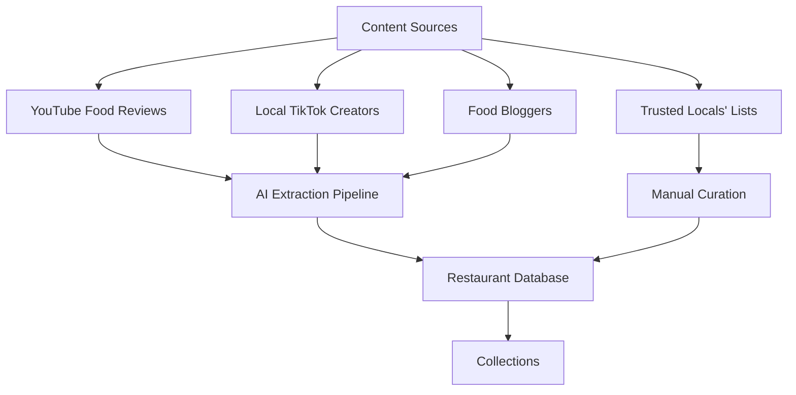

# Authentic Food Discovery App - Ideation & Strategy

## 🎯 Core Problem Statement

Vietnamese restaurants are plagued by:
- **Fake reviews** (1-2 review accounts, paid reviews)
- **Tourist trap dominance** (local gems buried under tourist-focused venues)
- **Influencer bias** (paid promotions masquerading as authentic recommendations)
- **Signal vs Noise** (hard to distinguish genuine local favorites from marketing)

## 💡 Core Value Proposition

**"Discover where locals actually eat"** - A curated platform that surfaces authentic dining experiences through:
1. **Trusted collections** from verified locals and credible sources
2. **Smart filtering** to remove fake/biased reviews
3. **Local vs Tourist labeling** to help users make informed choices
4. **Community-driven curation** with quality controls

---

## 🏗️ Product Architecture

### Phase 1: MVP - Curated Collections (Quick Market Entry)

#### Core Features
1. **Curated Collections**
   - Pre-built collections from trusted sources
   - "Recommended by [Creator Name]" format
   - Each collection has: creator profile, description, list of restaurants

2. **Restaurant Cards**
   - Name, location, cuisine type
   - "Local Favorite" vs "Tourist Spot" badge
   - Key dishes (extracted from source content)
   - Price range, neighborhood
   - Link to Google Maps

3. **Simple Discovery**
   - Browse collections by creator
   - Filter by neighborhood, cuisine type, price
   - Search by restaurant name or dish

#### Content Strategy (Fast Market Penetration)


### Phase 2: Community & Authenticity Engine

#### Advanced Features
1. **User-Generated Collections**
   - Quick list creation tool
   - Verification system (local status, review history)
   - Reputation scoring

2. **Authenticity Scoring**
   - Analyze Google/other platform reviews
   - Flag suspicious patterns (1-2 review accounts)
   - Weight reviews by reviewer credibility
   - Local vs tourist reviewer identification

3. **Heatmap Visualization**
   - Where locals eat (aggregated data)
   - Time-based patterns (lunch/dinner hotspots)
   - Neighborhood authenticity scores

---

## 🔧 Technical Implementation Ideas

### 1. Content Extraction Pipeline (YouTube/TikTok)

```javascript
// Pseudo-code for YouTube extraction
async function extractRestaurantsFromVideo(videoUrl) {
  // 1. Get transcript via YouTube API
  const transcript = await getTranscript(videoUrl);

  // 2. Use AI (GPT-4/Claude) to extract:
  const extracted = await aiExtract(transcript, {
    restaurants: [], // names, addresses
    dishes: [],      // mentioned dishes
    opinions: [],    // positive/negative sentiment
    timestamps: []   // when mentioned in video
  });

  // 3. Match with Google Places API
  const verified = await verifyWithGooglePlaces(extracted.restaurants);

  // 4. Create collection
  return {
    creator: getChannelInfo(videoUrl),
    restaurants: verified,
    source: videoUrl,
    extractedAt: new Date()
  };
}
```

### 2. Google Places API Integration

**Capabilities:**
- ✅ Fetch restaurant details (name, address, photos, ratings)
- ✅ Get reviews with reviewer profiles
- ✅ Place search and autocomplete
- ⚠️ Limited to 60 requests/minute (free tier)

**Authenticity Filter Engineering:**

```javascript
function calculateAuthenticityScore(place) {
  let score = 100;
  const reviews = place.reviews;

  // Flag 1: Suspicious reviewer patterns
  const suspiciousReviewers = reviews.filter(r =>
    r.author_total_reviews <= 2
  ).length;
  score -= (suspiciousReviewers / reviews.length) * 30;

  // Flag 2: Review timing clusters (fake review campaigns)
  const timeClusters = detectReviewClusters(reviews);
  score -= timeClusters * 10;

  // Flag 3: Generic review text (AI-generated)
  const genericReviews = reviews.filter(r =>
    isGenericText(r.text)
  ).length;
  score -= (genericReviews / reviews.length) * 20;

  // Boost: Reviewer is local (Vietnamese name, many local reviews)
  const localReviews = reviews.filter(r =>
    isLikelyLocal(r.author_name, r.author_reviews)
  ).length;
  score += (localReviews / reviews.length) * 20;

  return Math.max(0, Math.min(100, score));
}
```

### 3. Local vs Tourist Classification

```javascript
function classifyRestaurant(place, reviews) {
  const signals = {
    // Language signals
    vietnameseReviews: reviews.filter(r => isVietnamese(r.text)).length,
    foreignReviews: reviews.filter(r => !isVietnamese(r.text)).length,

    // Reviewer origin (if available via Google API)
    localReviewers: reviews.filter(r => isLocalReviewer(r)).length,
    touristReviewers: reviews.filter(r => isTouristReviewer(r)).length,

    // Location signals
    inTouristArea: isTouristHotspot(place.location),

    // Price signals
    priceLevel: place.price_level, // 1-4 scale

    // Menu signals (if available)
    hasEnglishMenu: place.has_english_menu,
    hasVietnameseOnlyMenu: !place.has_english_menu
  };

  // Weighted scoring
  const localScore = (
    signals.vietnameseReviews * 2 +
    signals.localReviewers * 3 +
    (!signals.inTouristArea ? 20 : 0) +
    (signals.hasVietnameseOnlyMenu ? 15 : 0)
  );

  return localScore > 50 ? 'LOCAL_FAVORITE' : 'TOURIST_SPOT';
}
```

### 4. Heatmap Implementation

**Data Sources:**
- Aggregated restaurant locations from collections
- User check-ins (future feature)
- Review density from verified locals

**Tech Stack:**
- **Mapbox GL JS** or **Google Maps JavaScript API**
- **Deck.gl** for heatmap layer visualization
- **Clustering** for performance with many points

---

## 📱 Product Design

### User Flows

#### 1. Discovery Flow
```
Home → Browse Collections → Select Collection →
View Restaurants → Select Restaurant → See Details →
Open in Google Maps / Save to Favorites
```

#### 2. Search Flow
```
Home → Search (dish/restaurant/neighborhood) →
Filter (local/tourist, price, cuisine) →
View Results → Select Restaurant
```

#### 3. Collection Creation Flow (Phase 2)
```
Profile → Create Collection → Add Restaurants
(search or paste Google Maps links) →
Add Notes/Dishes → Publish
```

### Key Screens

1. **Home**
   - Featured collections carousel
   - "Local Favorites" section
   - Neighborhood explorer
   - Search bar

2. **Collection Detail**
   - Creator profile card
   - Collection description
   - Restaurant list (cards with photos)
   - Map view toggle

3. **Restaurant Detail**
   - Photos, name, badges (Local/Tourist)
   - Authenticity score (Phase 2)
   - Key dishes
   - Location, hours, price range
   - "View on Google Maps" CTA
   - Which collections feature this place

4. **Map View**
   - Heatmap overlay (local dining density)
   - Restaurant pins (color-coded: local vs tourist)
   - Filter controls
   - List/Map toggle

---

## 🚀 Go-to-Market Strategy

### Phase 1: Seed Content (Months 1-2)

**Goal:** Build initial database of 200-300 curated restaurants

1. **Manual Curation**
   - Your personal list (already 50+ restaurants)
   - 5-10 trusted local friends' lists

2. **YouTube Extraction**
   - Target 20-30 authentic food review channels
   - Focus on: Quang Dung, local food vloggers
   - Extract ~10 restaurants per video

3. **TikTok Mining**
   - Identify top local food creators
   - Extract restaurant mentions from popular videos

### Phase 2: Soft Launch (Month 3)

**Target Audience:**
- Expats living in Vietnam
- Frequent travelers to Vietnam
- Vietnamese diaspora visiting home

**Channels:**
- Reddit (r/VietNam, r/Saigon, r/Hanoi)
- Facebook expat groups
- Instagram food communities
- Product Hunt

**Messaging:**
- "Stop eating where tourists eat"
- "Discover authentic Vietnamese food, curated by locals"

### Phase 3: Community Growth (Months 4-6)

1. **Invite System**
   - Verified locals can create collections
   - Reputation system (upvotes, follows)

2. **Partnerships**
   - Collaborate with authentic food bloggers
   - Feature their collections

3. **User Contributions**
   - Allow users to suggest restaurants for collections
   - Moderation queue for quality control

---

## 🎨 Design Principles

### Visual Identity
- **Authentic & Local** (not corporate/sterile)
- **Warm, inviting colors** (Vietnamese food culture)
- **Photo-first** (food is visual)
- **Trust indicators** (verified badges, creator profiles)

### UI/UX Priorities
1. **Fast discovery** (< 3 taps to find a restaurant)
2. **Visual browsing** (beautiful food photos)
3. **Trust signals** (who recommended this, why)
4. **Actionable** (easy to navigate to restaurant)

---

## 🔮 Future Features

### Advanced Authenticity Engine
- **Review sentiment analysis** (detect paid/fake patterns)
- **Reviewer network analysis** (identify review farms)
- **Price verification** (flag tourist markup)
- **Menu authenticity** (Vietnamese vs adapted dishes)

### Social Features
- **Follow curators** you trust
- **Collaborative collections** (friends' shared lists)
- **Check-ins & reviews** (verified locals only)
- **"Ask a local"** Q&A feature

### Personalization
- **Taste profile** (preferences, dietary restrictions)
- **Neighborhood recommendations** (where you live/stay)
- **"Hidden gems near you"** (proximity-based)

### Monetization (Long-term)
- **Premium collections** (exclusive access)
- **Restaurant partnerships** (verified badge, featured placement)
- **Food tour bookings** (curated experiences)
- **Affiliate links** (delivery, reservations)

---

## 🛠️ Tech Stack Recommendations

### Mobile/Web App
- **Framework:** React Native (cross-platform) or Next.js (web-first)
- **Maps:** Mapbox GL or Google Maps API
- **Backend:** Supabase (auth, database, storage)
- **AI/ML:** OpenAI API (content extraction, analysis)

### Data Pipeline
- **YouTube API:** Transcript extraction
- **Google Places API:** Restaurant data, reviews
- **Web Scraping:** TikTok (if no API access)
- **Processing:** Python scripts, scheduled jobs

### Infrastructure
- **Hosting:** Vercel (web) / Expo (mobile)
- **Database:** PostgreSQL (Supabase)
- **Storage:** Supabase Storage (images)
- **Analytics:** Mixpanel or PostHog

---

## 📊 Success Metrics

### Early Stage (Months 1-3) - Da Nang MVP
- 100-150 curated restaurants (Da Nang)
- 10-15 collections
- 500+ app downloads/visits
- 5+ active curators

### Growth Stage (Months 4-12)
- 1,000+ restaurants
- 100+ collections
- 50,000+ users
- 20% monthly active users
- 5+ user-generated collections/week

### Engagement
- Avg. 3+ restaurants viewed per session
- 30%+ click-through to Google Maps
- 20%+ save/favorite rate

---

## 🤔 Open Questions & Decisions

### 1. Platform Priority ✅ DECIDED
- **Web-first** (easier to build, test, iterate) ✅ **CHOSEN**
- Mobile app in Phase 2

### 2. Geographic Focus ✅ DECIDED
- **Da Nang only** for MVP ✅ **CHOSEN**
- Expand to Saigon, Hanoi after validation

### 2. Google API Usage
- **Free tier limits:** 60 requests/min, $200/month credit
- **Strategy:** Cache aggressively, batch requests
- **Alternative:** Scrape Google Maps (risky, against ToS)

### 3. Content Moderation
- **Manual review** (slow, high quality)
- **AI-assisted** (faster, needs oversight)
- **Community moderation** (scalable, needs incentives)

### 4. Authenticity Score Display
- **Show score** (transparent, educational)
- **Hide score, use badges** (simpler, less intimidating)
- **Show only for low scores** (warning system)

### 5. Monetization Timeline
- **Free forever** (build audience first)
- **Freemium** (basic free, premium features)
- **B2B** (sell to tourism boards, hotels)

---

## 🎬 Next Steps

### Immediate (This Week)
1. ✅ Validate concept with 10-20 potential users
2. ✅ Analyze your existing restaurant list structure
3. ✅ Test YouTube transcript extraction (1-2 videos)
4. ✅ Prototype simple restaurant card design

### Short-term (Next 2 Weeks)
1. Build MVP web app (simple collection browser)
2. Extract 5-10 collections from YouTube
3. Implement Google Places API integration
4. Design authenticity scoring algorithm v1

### Medium-term (Next Month)
1. Soft launch to 50-100 beta users
2. Gather feedback, iterate
3. Build heatmap visualization
4. Expand to 200+ restaurants

---

## 💬 Discussion Points

1. **How do we verify "local" status for curators?**
   - Ideas: Phone number verification, social proof, manual review

3. **What's the minimum viable collection?**
   - Recommendation: 10-15 restaurants with photos, dishes, notes

4. **How do we handle restaurant closures/changes?**
   - Strategy: Community reporting, periodic verification

5. **Should we allow negative reviews/ratings?**
   - Recommendation: No ratings, only curated inclusions (positive signal)

