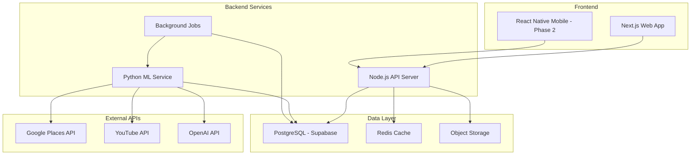

# Tech Stack - Authentic Food Discovery App

## Overview

This document outlines the recommended technology stack for building the authentic food discovery platform, with a focus on **web-first development** and heavy AI/ML classification capabilities.

---

## 🎯 Architecture Philosophy

### Core Principles
1. **Web-first, mobile later** - Rapid iteration and testing
2. **AI/ML heavy** - Content extraction, classification, filtering
3. **Scalable from day one** - Handle growth without rewrites
4. **Developer productivity** - Fast iteration cycles
5. **Cost-effective** - Optimize for startup budget

### System Architecture



---

## 🔧 Backend Language: Python vs Go vs Node.js

### Python ✅ **RECOMMENDED for ML Service**

**Strengths:**
- 🎯 **Best-in-class AI/ML libraries**
  - OpenAI SDK, LangChain, Hugging Face
  - NLP libraries: spaCy, NLTK, transformers
  - Data science: pandas, numpy, scikit-learn
- 🎯 **YouTube/content extraction**
  - `youtube-transcript-api` for transcripts
  - `beautifulsoup4`, `scrapy` for web scraping
- 🎯 **Rapid prototyping** for ML algorithms
- 🎯 **Huge ecosystem** for data processing

**Weaknesses:**
- ⚠️ Slower runtime performance (vs Go)
- ⚠️ Higher memory usage
- ⚠️ GIL limitations for true parallelism

**Use Cases:**
- ✅ Content extraction pipeline (YouTube, TikTok)
- ✅ Authenticity scoring algorithms
- ✅ Review classification (fake detection)
- ✅ Local vs tourist classification
- ✅ Batch processing jobs

### Node.js ✅ **RECOMMENDED for API Server**

**Strengths:**
- 🎯 **Same language as frontend** (TypeScript)
- 🎯 **Excellent for APIs** - Express, Fastify, tRPC
- 🎯 **Great async I/O** for handling many requests
- 🎯 **Rich ecosystem** - npm packages for everything
- 🎯 **Easy deployment** - Vercel, Railway, Fly.io
- 🎯 **Fast iteration** - Hot reload, quick builds

**Weaknesses:**
- ⚠️ Limited ML/AI libraries (vs Python)
- ⚠️ Less performant for CPU-heavy tasks (vs Go)

**Use Cases:**
- ✅ REST/GraphQL API server
- ✅ User authentication & authorization
- ✅ CRUD operations
- ✅ Real-time features (WebSockets)
- ✅ Integration with frontend (Next.js)

### Go ⚠️ **NOT RECOMMENDED (for now)**

**Strengths:**
- 🎯 **Blazing fast** - Compiled, concurrent
- 🎯 **Low memory footprint**
- 🎯 **Great for microservices**
- 🎯 **Built-in concurrency** (goroutines)

**Weaknesses:**
- ⚠️ **Limited AI/ML ecosystem** (vs Python)
- ⚠️ **Steeper learning curve**
- ⚠️ **Slower development** (vs Python/Node)
- ⚠️ **Smaller community** for web apps

**When to consider:**
- Later stage optimization (high traffic)
- Specific microservices (e.g., real-time heatmap)

---

## 🏗️ Recommended Hybrid Architecture

### **Best of Both Worlds: Node.js + Python**

```
┌─────────────────────────────────────────────────────┐
│                   Frontend Layer                     │
│              Next.js (React + TypeScript)            │
└─────────────────────────────────────────────────────┘
                          │
                          ▼
┌─────────────────────────────────────────────────────┐
│                  API Layer (Node.js)                 │
│  - User auth, CRUD operations                        │
│  - Request routing                                   │
│  - Caching (Redis)                                   │
│  - Real-time features                                │
└─────────────────────────────────────────────────────┘
                          │
                ┌─────────┴─────────┐
                ▼                   ▼
┌───────────────────────┐  ┌──────────────────────────┐
│  PostgreSQL (Supabase)│  │  Python ML Service       │
│  - User data          │  │  - Content extraction    │
│  - Restaurants        │  │  - Classification        │
│  - Collections        │  │  - Authenticity scoring  │
│  - Reviews cache      │  │  - Background jobs       │
└───────────────────────┘  └──────────────────────────┘
                                      │
                                      ▼
                          ┌──────────────────────┐
                          │   External APIs      │
                          │  - Google Places     │
                          │  - YouTube           │
                          │  - OpenAI            │
                          └──────────────────────┘
```

### Communication Pattern
- **Node.js API ↔ Python Service**: REST API or message queue (Redis, BullMQ)
- **Frontend ↔ Node.js API**: REST or tRPC (type-safe)
- **Python Service**: Runs as separate service, triggered by jobs

---

## 📦 Detailed Tech Stack

### Frontend (Web-First)

#### Framework: **Next.js 14+ (App Router)**
```json
{
  "framework": "Next.js 14",
  "language": "TypeScript",
  "styling": "Tailwind CSS + shadcn/ui",
  "state": "Zustand or React Query",
  "maps": "Mapbox GL JS",
  "deployment": "Vercel"
}
```

**Why Next.js?**
- ✅ Server-side rendering (SEO-friendly)
- ✅ API routes (can handle simple backend logic)
- ✅ Image optimization (critical for food photos)
- ✅ Fast refresh, great DX
- ✅ Easy deployment to Vercel

**UI Components:**
- **shadcn/ui** - Beautiful, customizable components
- **Tailwind CSS** - Rapid styling
- **Framer Motion** - Smooth animations
- **Mapbox GL JS** - Interactive maps & heatmaps

---

### Backend Services

#### 1. API Server: **Node.js + TypeScript**

**Framework Options:**

| Framework | Pros | Cons | Recommendation |
|-----------|------|------|----------------|
| **Next.js API Routes** | Same codebase, easy deployment | Limited for complex logic | ✅ Start here |
| **Express.js** | Simple, flexible | Boilerplate-heavy | ⚠️ If Next.js insufficient |
| **Fastify** | Fast, plugin ecosystem | Smaller community | ⚠️ Performance critical |
| **tRPC** | Type-safe, no REST boilerplate | Locked to TypeScript | ✅ Recommended |

**Recommended: Next.js API Routes + tRPC**
```typescript
// app/api/trpc/[trpc]/route.ts
import { appRouter } from '@/server/routers/_app';
import { createTRPCContext } from '@/server/trpc';

export const GET = async (req: Request) => {
  return fetchRequestHandler({
    endpoint: '/api/trpc',
    req,
    router: appRouter,
    createContext: createTRPCContext,
  });
};
```

**Key Libraries:**
- `@trpc/server` - Type-safe API
- `@supabase/supabase-js` - Database client
- `ioredis` - Redis caching
- `zod` - Schema validation
- `bullmq` - Job queue (trigger Python jobs)

---

#### 2. ML/Classification Service: **Python**

**Framework: FastAPI**
```python
# main.py
from fastapi import FastAPI
from pydantic import BaseModel

app = FastAPI()

class VideoExtractionRequest(BaseModel):
    video_url: str
    creator_name: str

@app.post("/extract-restaurants")
async def extract_restaurants(request: VideoExtractionRequest):
    # Extract restaurants from YouTube video
    transcript = get_youtube_transcript(request.video_url)
    restaurants = extract_with_openai(transcript)
    verified = verify_with_google_places(restaurants)
    return {"restaurants": verified}
```

**Key Libraries:**

| Category | Library | Purpose |
|----------|---------|---------|
| **Web Framework** | `fastapi` | API server |
| **AI/ML** | `openai`, `langchain` | Content extraction, classification |
| **NLP** | `spacy`, `transformers` | Text analysis, language detection |
| **Data** | `pandas`, `numpy` | Data processing |
| **YouTube** | `youtube-transcript-api` | Get video transcripts |
| **Google API** | `googlemaps` | Places API integration |
| **Web Scraping** | `beautifulsoup4`, `playwright` | TikTok extraction |
| **Background Jobs** | `celery` or `arq` | Async task processing |

**Deployment:**
- **Railway** or **Fly.io** (easy Python deployment)
- **Docker** container
- Separate from Node.js API

---

### Database & Storage

#### Primary Database: **PostgreSQL (via Supabase)**

**Why Supabase?**
- ✅ Managed PostgreSQL (no DevOps)
- ✅ Built-in auth (email, social login)
- ✅ Real-time subscriptions
- ✅ Storage for images
- ✅ Auto-generated REST API
- ✅ Generous free tier

**Schema Example:**
```sql
-- Collections
CREATE TABLE collections (
  id UUID PRIMARY KEY DEFAULT uuid_generate_v4(),
  name TEXT NOT NULL,
  description TEXT,
  creator_id UUID REFERENCES auth.users(id),
  creator_name TEXT,
  source_url TEXT, -- YouTube video URL
  created_at TIMESTAMPTZ DEFAULT NOW()
);

-- Restaurants
CREATE TABLE restaurants (
  id UUID PRIMARY KEY DEFAULT uuid_generate_v4(),
  google_place_id TEXT UNIQUE,
  name TEXT NOT NULL,
  address TEXT,
  location GEOGRAPHY(POINT), -- PostGIS for geospatial
  cuisine_type TEXT[],
  price_level INTEGER,
  authenticity_score FLOAT,
  classification TEXT, -- 'LOCAL_FAVORITE' or 'TOURIST_SPOT'
  created_at TIMESTAMPTZ DEFAULT NOW()
);

-- Collection Items (many-to-many)
CREATE TABLE collection_restaurants (
  collection_id UUID REFERENCES collections(id),
  restaurant_id UUID REFERENCES restaurants(id),
  notes TEXT,
  recommended_dishes TEXT[],
  PRIMARY KEY (collection_id, restaurant_id)
);

-- Cached Reviews (from Google)
CREATE TABLE reviews_cache (
  id UUID PRIMARY KEY DEFAULT uuid_generate_v4(),
  restaurant_id UUID REFERENCES restaurants(id),
  google_review_id TEXT UNIQUE,
  author_name TEXT,
  author_total_reviews INTEGER,
  text TEXT,
  rating INTEGER,
  language TEXT,
  is_local BOOLEAN,
  is_suspicious BOOLEAN,
  created_at TIMESTAMPTZ,
  cached_at TIMESTAMPTZ DEFAULT NOW()
);
```

#### Caching: **Redis**

**Use Cases:**
- API response caching (Google Places results)
- Rate limiting
- Session storage
- Job queue (BullMQ)

**Provider:** Upstash (serverless Redis, free tier)

---

### External APIs

#### 1. Google Places API
- **Tier:** Pay-as-you-go ($200/month free credit)
- **Rate Limit:** 60 requests/min (free tier)
- **Strategy:** Aggressive caching (30-day TTL)

#### 2. YouTube Data API
- **Tier:** Free (10,000 units/day)
- **Use:** Get video metadata, channel info
- **Note:** Transcripts via `youtube-transcript-api` (no quota)

#### 3. OpenAI API
- **Model:** GPT-4 Turbo or GPT-3.5 Turbo
- **Use:** Extract restaurants from transcripts, classify reviews
- **Cost:** ~$0.01 per video extraction

---

## 💰 Cost-Effective AI Alternatives (MVP Stage)

### Problem: OpenAI API Costs

**OpenAI Pricing (as of 2026):**
- GPT-4 Turbo: $10/1M input tokens, $30/1M output tokens
- GPT-3.5 Turbo: $0.50/1M input tokens, $1.50/1M output tokens

**Estimated costs for 200 video extractions:**
- Average transcript: ~5,000 tokens input, ~500 tokens output
- GPT-4: ~$12.50 per 200 videos
- GPT-3.5: ~$0.63 per 200 videos

While not huge, costs scale linearly with usage. For MVP, here are better alternatives:

---

### ✅ Recommended: Hybrid Approach

**Strategy: Combine cheap/free tools for 80% of work, use paid AI for edge cases**

#### 1. **Google Gemini API** (Free Tier)

**Why Gemini?**
- ✅ **Free tier: 60 requests/minute** (vs OpenAI's paid-only)
- ✅ **Gemini 1.5 Flash**: Fast, cheap, good for extraction
- ✅ **Gemini 1.5 Pro**: Free up to 2 RPM (rate-limited but free)
- ✅ **Same capabilities** as GPT-3.5 for structured extraction

**Pricing:**
```
Gemini 1.5 Flash:  FREE up to 15 RPM, then $0.075/1M input tokens
Gemini 1.5 Pro:    FREE up to 2 RPM, then $1.25/1M input tokens
```

**Implementation:**
```python
import google.generativeai as genai

genai.configure(api_key="YOUR_API_KEY")
model = genai.GenerativeModel('gemini-1.5-flash')

def extract_restaurants_from_transcript(transcript: str):
    prompt = f"""
    Extract restaurant information from this Vietnamese food review transcript.
    Return JSON with: name, address, dishes mentioned, sentiment.

    Transcript: {transcript}
    """

    response = model.generate_content(prompt)
    return parse_json(response.text)
```

**Cost for 200 videos: $0 (within free tier)** 🎉

---

#### 2. **Open-Source LLMs** (Self-Hosted or Free APIs)

**Option A: Llama 3.1 (via Groq API - FREE)**

```python
from groq import Groq

client = Groq(api_key="YOUR_API_KEY")

def extract_with_llama(transcript: str):
    completion = client.chat.completions.create(
        model="llama-3.1-70b-versatile",  # Free tier
        messages=[{
            "role": "user",
            "content": f"Extract restaurants from: {transcript}"
        }]
    )
    return completion.choices[0].message.content
```

**Groq Pricing:**
- ✅ **FREE tier**: 30 requests/minute (Llama 3.1)
- ✅ **Blazing fast** (500+ tokens/sec)
- ✅ **Good quality** for structured extraction

**Option B: Ollama (100% Free, Self-Hosted)**

```python
import ollama

def extract_with_ollama(transcript: str):
    response = ollama.chat(
        model='llama3.1:8b',  # Run locally
        messages=[{
            'role': 'user',
            'content': f'Extract restaurants from: {transcript}'
        }]
    )
    return response['message']['content']
```

**Pros:**
- ✅ **$0 cost** (run on your laptop/server)
- ✅ **No rate limits**
- ✅ **Privacy** (no data sent externally)

**Cons:**
- ⚠️ Requires GPU (or slow on CPU)
- ⚠️ Lower quality than GPT-4 (but good enough for MVP)

---

#### 3. **Regex + Heuristics** (For Simple Patterns)

**For MVP, you can use rule-based extraction for 70% of cases:**

```python
import re
from typing import List, Dict

def extract_restaurants_simple(transcript: str) -> List[Dict]:
    """
    Use regex patterns to extract Vietnamese restaurant names
    """
    restaurants = []

    # Pattern 1: "Quán [Name]" or "Nhà hàng [Name]"
    pattern1 = r'(?:quán|nhà hàng|tiệm)\s+([A-ZẮẰẲẴẶĂẤẦẨẪẬÂÁÀÃẢẠĐẾỀỂỄỆÊÉÈẺẼẸÍÌỈĨỊỐỒỔỖỘÔỚỜỞỠỢƠÓÒÕỎỌÚÙỦŨỤỨỪỬỮỰƯÝỲỶỸỴ][a-zắằẳẵặăấầẩẫậâáàãảạđếềểễệêéèẻẽẹíìỉĩịốồổỗộôớờởỡợơóòõỏọúùủũụứừửữựưýỳỷỹỵ\s]+)'

    # Pattern 2: Street addresses (e.g., "123 Nguyễn Huệ")
    pattern2 = r'(\d+\s+[A-ZẮẰẲẴẶĂẤẦẨẪẬÂÁÀÃẢẠĐẾỀỂỄỆÊÉÈẺẼẸÍÌỈĨỊỐỒỔỖỘÔỚỜỞỠỢƠÓÒÕỎỌÚÙỦŨỤỨỪỬỮỰƯÝỲỶỸỴ][a-zắằẳẵặăấầẩẫậâáàãảạđếềểễệêéèẻẽẹíìỉĩịốồổỗộôớờởỡợơóòõỏọúùủũụứừửữựưýỳỷỹỵ\s]+)'

    matches1 = re.finditer(pattern1, transcript, re.IGNORECASE)
    matches2 = re.finditer(pattern2, transcript)

    for match in matches1:
        restaurants.append({
            'name': match.group(1).strip(),
            'type': 'name_mention'
        })

    for match in matches2:
        restaurants.append({
            'address': match.group(1).strip(),
            'type': 'address_mention'
        })

    return restaurants

def verify_with_google_places(candidates: List[Dict]) -> List[Dict]:
    """
    Use Google Places API to verify and enrich extracted data
    """
    verified = []
    for candidate in candidates:
        # Search Google Places
        query = candidate.get('name') or candidate.get('address')
        place = search_google_places(query)
        if place:
            verified.append(place)
    return verified
```

**Hybrid Workflow:**
```
1. Use regex to extract obvious patterns (70% success rate)
2. For unmatched transcripts, use Gemini Flash (free)
3. Verify all with Google Places API (required anyway)
```

**Cost: $0 for extraction + Google Places API only**

---

#### 4. **Anthropic Claude** (Cheaper Alternative)

**If you need better quality than Gemini:**

```python
import anthropic

client = anthropic.Anthropic(api_key="YOUR_API_KEY")

def extract_with_claude(transcript: str):
    message = client.messages.create(
        model="claude-3-haiku-20240307",  # Cheapest model
        max_tokens=1024,
        messages=[{
            "role": "user",
            "content": f"Extract restaurants from: {transcript}"
        }]
    )
    return message.content
```

**Pricing:**
- Claude 3 Haiku: $0.25/1M input, $1.25/1M output
- **50% cheaper than GPT-3.5**
- Better quality than Gemini Flash

---

### 🎯 MVP Recommendation: **3-Tier Approach**

```python
async def extract_restaurants_from_video(video_url: str):
    # Step 1: Get transcript (free)
    transcript = await get_youtube_transcript(video_url)

    # Step 2: Try regex extraction (free, fast)
    candidates = extract_restaurants_simple(transcript)

    # Step 3: If regex found < 3 restaurants, use AI
    if len(candidates) < 3:
        # Use Gemini Flash (free tier)
        ai_candidates = await extract_with_gemini(transcript)
        candidates.extend(ai_candidates)

    # Step 4: Verify with Google Places (required anyway)
    verified = await verify_with_google_places(candidates)

    return verified
```

**Cost Breakdown:**
- Regex extraction: **$0**
- Gemini Flash (fallback): **$0** (free tier)
- Google Places API: **~$5/month** (only real cost)

**Total: ~$5/month for 200 video extractions** 🎉

---

### 📊 Cost Comparison Table

| Approach | Cost (200 videos) | Quality | Speed | Recommendation |
|----------|-------------------|---------|-------|----------------|
| **GPT-4 Turbo** | $12.50 | ⭐⭐⭐⭐⭐ | Fast | ❌ Overkill for MVP |
| **GPT-3.5 Turbo** | $0.63 | ⭐⭐⭐⭐ | Fast | ⚠️ Cheap but not free |
| **Gemini 1.5 Flash** | **$0** | ⭐⭐⭐⭐ | Very Fast | ✅ **Best for MVP** |
| **Groq (Llama 3.1)** | **$0** | ⭐⭐⭐ | Blazing | ✅ Great alternative |
| **Ollama (Self-hosted)** | **$0** | ⭐⭐⭐ | Slow (CPU) | ⚠️ If you have GPU |
| **Claude Haiku** | $0.31 | ⭐⭐⭐⭐ | Fast | ⚠️ If Gemini insufficient |
| **Regex + Heuristics** | **$0** | ⭐⭐ | Instant | ✅ Use as first pass |

---

### 🔧 Implementation Strategy

**Phase 1: MVP (Free Tier Only)**
```python
# config.py
AI_PROVIDER = "gemini"  # or "groq" or "regex"
FALLBACK_TO_AI = True   # Use AI if regex fails
```

**Phase 2: Scale (Optimize Costs)**
```python
# Smart routing based on complexity
if is_simple_transcript(transcript):
    use_regex()
elif is_vietnamese_only(transcript):
    use_gemini_flash()  # Free
else:
    use_claude_haiku()  # Cheap, handles English better
```

**Phase 3: Production (Quality + Cost)**
```python
# Use GPT-4 for user-generated content (high stakes)
# Use Gemini for batch processing (low stakes)
```

---

### ✅ Final MVP Recommendation

**🎯 BEST FOR MVP: Antigravity-Assisted Manual Curation**

Since you have access to Antigravity (this AI assistant), you can leverage it for **free, unlimited AI assistance** during the MVP phase:

**Workflow:**
1. **Collect YouTube URLs** of Da Nang food reviews
2. **Ask Antigravity** to extract restaurants from each video
3. **Antigravity provides** structured JSON with restaurant names, addresses, dishes
4. **You review & approve** the extracted data
5. **Script verifies** with Google Places API
6. **Import to database**

**Example Interaction:**
```
You: "Extract restaurants from this Da Nang food review: [YouTube URL]"

Antigravity:
- Quán Bún Chả Cá, 123 Trần Phú, dishes: bún chả cá
- Nhà Hàng Bà Dưỡng, 456 Lê Duẩn, dishes: mì quảng
- [structured JSON output]

You: "Looks good, save to database"
```

**Advantages:**
- ✅ **$0 cost** (no API fees)
- ✅ **Unlimited usage** (no rate limits)
- ✅ **High quality** (Antigravity = GPT-4 level)
- ✅ **Interactive** (can clarify, iterate)
- ✅ **Perfect for MVP** (manual scale, ~100-150 restaurants)

**When to Switch to Automated:**
- When you need to process > 500 videos
- When you want user-generated extractions
- Phase 2: Use Gemini/Groq for automation

**Cost: $0 for AI + ~$5/month for Google Places API**

---

## 🚀 Development Workflow

### Local Development

```bash
# Frontend + API (Next.js)
cd web
npm run dev  # http://localhost:3000

# Python ML Service
cd ml-service
uvicorn main:app --reload  # http://localhost:8000

# Database
# Supabase local development
npx supabase start
```

### Project Structure

```
authentik/
├── web/                    # Next.js frontend + API
│   ├── app/               # App router
│   │   ├── (routes)/      # Page routes
│   │   ├── api/           # API routes (tRPC)
│   │   └── layout.tsx
│   ├── components/        # React components
│   ├── lib/               # Utilities
│   └── server/            # tRPC routers
│
├── ml-service/            # Python ML service
│   ├── main.py            # FastAPI app
│   ├── extractors/        # YouTube, TikTok extractors
│   ├── classifiers/       # Authenticity, local vs tourist
│   ├── models/            # Pydantic models
│   └── requirements.txt
│
├── supabase/              # Database
│   ├── migrations/        # SQL migrations
│   └── seed.sql           # Seed data
│
└── docs/                  # Documentation
    ├── ideation.md
    └── tech-stack.md
```

---

## 📊 Cost Estimation (Monthly)

### MVP Stage - Da Nang Focus (< 500 users)

| Service | Tier | Cost |
|---------|------|------|
| **Vercel** (Next.js hosting) | Hobby | $0 |
| **Supabase** | Free tier | $0 (500MB DB, 1GB storage) |
| **Upstash Redis** | Free tier | $0 (10K commands/day) |
| **Google Places API** | Free credit | $0 (< $200/month) |
| **AI Extraction** | Antigravity | **$0** (manual-assisted) |
| **Mapbox** | Free tier | $0 (50K loads/month) |
| **Total** | | **$0/month** 🎉 |

**Note:** Python service not needed for MVP since we're using Antigravity for manual extraction

### Growth Stage (10,000 users)

| Service | Tier | Cost |
|---------|------|------|
| **Vercel** | Pro | $20 |
| **Railway** | Paid | $20 |
| **Supabase** | Pro | $25 |
| **Upstash Redis** | Paid | $10 |
| **Google Places API** | Over free tier | $100 |
| **OpenAI API** | Pay-as-you-go | $50 |
| **Mapbox** | Paid | $5 |
| **Total** | | **~$230/month** |

---

## 🔄 Migration Path (Future)

### When to Consider Go

**Signals:**
- API response times > 500ms consistently
- Database queries bottleneck (need connection pooling)
- > 100K monthly active users
- Real-time features (heatmap updates) lag

**Migration Strategy:**
1. Keep Node.js API for CRUD operations
2. Rewrite hot paths in Go (e.g., heatmap service)
3. Use Go for new microservices
4. Python stays for ML/AI workloads

---

## ✅ Final Recommendation

### Phase 1: MVP (Months 1-3)

```
Frontend:  Next.js 14 + TypeScript + Tailwind + shadcn/ui
API:       Next.js API Routes + tRPC
ML:        Python + FastAPI
Database:  PostgreSQL (Supabase)
Cache:     Redis (Upstash)
Hosting:   Vercel (Next.js) + Railway (Python)
```

### Why This Stack?

1. **Fast iteration** - TypeScript everywhere (except ML)
2. **Best AI/ML tools** - Python for classification
3. **Cost-effective** - Free tiers cover MVP
4. **Scalable** - Can handle 10K+ users without rewrite
5. **Developer-friendly** - Great DX, hot reload, type safety
6. **Future-proof** - Easy to add Go microservices later

### Trade-offs Accepted

- ❌ Not the absolute fastest (Go would be)
- ✅ But fast enough + way faster development
- ❌ Two languages (Node + Python)
- ✅ But each does what it's best at
- ❌ Slightly higher hosting costs (vs single Go binary)
- ✅ But offset by faster time-to-market

---

## 🎯 Next Steps

1. **Set up Next.js project** with TypeScript, Tailwind, tRPC
2. **Create Supabase project** and design schema
3. **Build Python FastAPI service** for YouTube extraction
4. **Test Google Places API** integration
5. **Prototype authenticity scoring** algorithm

**Ready to start building?** 🚀
